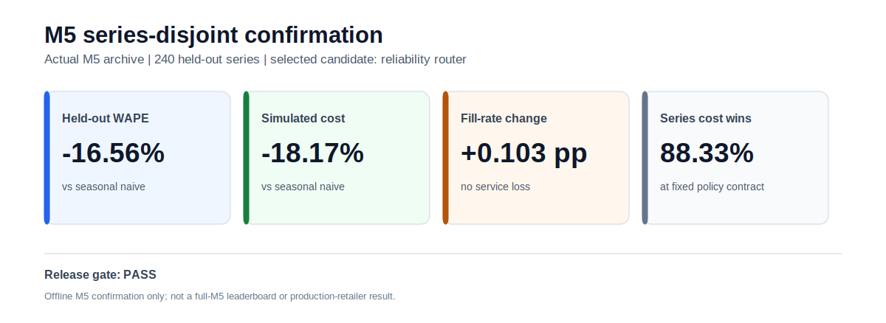
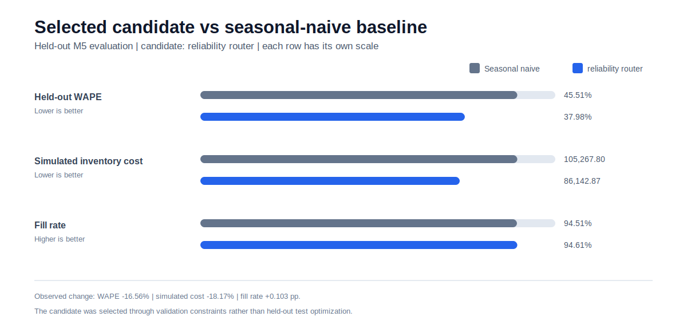
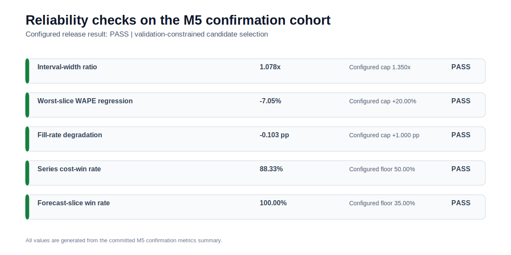

# State-Aligned, Stockout-Aware Demand Forecasting & Inventory Decision System

End-to-end offline retail science framework for demand forecasting, stockout-censoring recovery, probabilistic inventory decisions, and release reliability.

Current release candidate: **0.6.2**.

## What the repository demonstrates

1. **Forecasting foundations:** seasonal naive, TSB intermittent-demand forecasting, quantile GBM, disjoint temporal calibration/validation/test folds, WAPE, bias, interval coverage, and slice diagnostics.
2. **Production-style data science:** config-driven batches, causal M5 preparation, SQL marts, run-specific manifests, deterministic sampling, tests, wheel packaging, CI, and release gates.
3. **Advanced methods:** sequential conformalized quantile calibration, correlated scenario paths, sample-level hierarchy reconciliation, decision-aware model routing, and optional Chronos-2 zero-shot/LoRA and PySpark adapters.
4. **Research specialty:** PHT-derived demand-state alignment, controlled stockout-censored latent-demand recovery, and closed-loop policy-feedback evaluation.

## Claim boundaries

- `configs/smoke.yaml` always uses deterministic synthetic retail data.
- `configs/m5_smoke.yaml` requires the configured M5 ZIP and never silently substitutes synthetic data.
- M5 supports retail hierarchy, price, calendar, and demand forecasting experiments. It does not contain true inventory, lost-demand, stockout, or lifecycle labels.
- Recovery accuracy is claimed only on controlled censoring rows where latent demand is retained by construction.
- LADT lifecycle recovery is claimed only on a controlled lifecycle benchmark.
- Inventory improvements are simulator results under documented cost, lead-time, and service assumptions.
- Chronos-2 and PySpark adapters are implemented, but their optional runtimes are not required for the CPU-safe core pipeline.

<!-- README_VISUALS_START -->
## Visual evidence at a glance

These figures are generated from committed M5 confirmation metrics:

```bash
python scripts/generate_readme_visuals.py --root . --output-dir docs/figures
```

They show offline held-out M5 confirmation evidence. They are not full-M5 leaderboard, production-retailer, or deployment outcomes.

### M5 confirmation scorecard



### Held-out outcome summary



### Reliability checks



<!-- README_VISUALS_END -->
## Quickstart

```bash
python -m venv .venv
source .venv/bin/activate  # Windows: .venv\Scripts\activate
python -m pip install --upgrade pip
python -m pip install -r requirements.txt

make smoke
make sql
make test
```

Run outputs are isolated by run name:

```text
reports/synthetic_smoke/
artifacts/synthetic_smoke/
data/processed/synthetic_smoke/
```

The principal evidence files are:

```text
reports/<run_name>/metrics_summary.json
reports/<run_name>/release_gate.json
reports/<run_name>/release_report.md
reports/<run_name>/forecast_output.csv
reports/<run_name>/inventory_simulation.csv
reports/<run_name>/closed_loop_replay.csv
artifacts/<run_name>/run_manifest.json
```


## M5 expanded confirmation evidence

The release candidate includes a development-to-confirmation M5 evidence protocol.

- **Development cohort:** 240 deterministic M5 series, used to identify and correct an unconstrained cost-first selection defect.
- **Confirmation cohort:** a deterministic 240-series cohort with `series_offset: 240`; the cohort-disjointness check recorded zero overlap with development.
- **Confirmation result:** validation-constrained routing selected `reliability_router`, improved held-out WAPE by **16.56%**, reduced simulated inventory cost by **18.17%**, improved fill rate by **0.103 percentage points**, and passed every configured release gate.
- **Selection contract:** candidates must satisfy validation WAPE, worst-slice, service-level, and interval-sharpness constraints before validation inventory cost is optimized.
- **Boundary:** this is offline M5 benchmark evidence on a 240-series confirmation cohort. It is not full-M5, external-retailer, production, GPU, Chronos zero-shot, or LoRA validation.

For local Windows execution, use `Amazon08_run_verified_v4.ps1`, which discovers the local M5 archive and writes a runtime-specific config. The checked-in M5 configs retain the portable `/mnt/data/m5-forecasting-accuracy.zip` convention used by the repository's portable and archive paths.

## Version 0.6 hardening

The current release adds operational controls beyond model evaluation:

- rollback to the last valid run when a pipeline stage raises an exception,
- source-archive CRC, path-traversal, symlink, root-layout, checksum, and byte-size validation,
- model-isolated inventory simulation with common initial inventory,
- temporally balanced audit samples that retain the latest periods,
- PEP 639-compatible package metadata and a Docker build context containing the license file,
- optional stage-level progress logs for local and CI troubleshooting.

Set `INVENTORY_AI_PROGRESS=1` to print stage completion and elapsed time to stderr.

## Architecture

```text
raw or synthetic retail panel
  -> causal data and feature contracts
  -> DRAT/LADT state alignment
  -> controlled stockout censoring and posterior recovery
  -> seasonal naive / TSB / quantile GBM
  -> sequential conformal calibration
  -> decision-aware series router
  -> correlated probabilistic scenarios
  -> point and sample-level hierarchy reconciliation
  -> periodic-review inventory simulation
  -> closed-loop feedback replay
  -> worst-slice and business release gates
  -> SQL marts, reports, and reproducibility manifests
```

## Run modes

```bash
make smoke       # deterministic synthetic track
make m5-smoke    # actual M5 ZIP specified in configs/m5_smoke.yaml
make auto-local  # fallback only when the configured archive is absent and allowed
make verify      # tests, synthetic pipeline, SQL, manifest, wheel, isolated import
make verify-m5   # optional M5 test, M5 pipeline, SQL, manifest
```

## Current verified small-data evidence

| Metric | Synthetic | M5 small-data |
|---|---:|---:|
| Release | PASS | PASS |
| Selected model | TSB | decision-aware reliability router |
| Selected policy scale | 0.80 | 0.90 |
| WAPE improvement vs seasonal naive | 3.23% | 5.06% |
| 80% interval coverage | 92.26% | 83.04% |
| Interval-width ratio vs seasonal | 0.980 | 1.320 |
| Simulated inventory-cost change | -4.04% | -9.40% |
| SKU cost-win rate | 83.33% | 83.33% |
| Recovery MAE improvement | 28.56% | 40.39% |
| Recovery absolute-bias improvement | 51.69% | 69.36% |
| LADT MAE | 0.0976 | 0.0867 |
| LADT Spearman | 0.878 | 0.900 |
| Scenario hierarchy error | 0 | 0 |

These are offline small-data results, not production retailer impact estimates.

## Optional advanced paths

The implemented Chronos adapter is at:

```text
src/inventory_ai/models/chronos_adapter.py
scripts/run_chronos.py
```

```bash
python -m pip install -e .[chronos]
make chronos-zero-shot
make chronos-lora
```

The implemented Spark feature path is at:

```text
src/inventory_ai/data/spark_features.py
scripts/run_spark_features.py
```

```bash
python -m pip install -e .[spark]
make spark-features
```

Advanced candidates are promoted only when predictive, probabilistic, worst-slice, inventory, fill-rate, and closed-loop gates pass. Seasonal naive remains an eligible operational fallback.

## 0.6.1 release hardening

- Source packages exclude coverage databases, environment files, editor state, and notebook checkpoints.
- Archive verification rejects duplicate, encrypted, traversal, symlink, multi-root, and explicit special-file members.
- Chronos rejects partially populated future covariates and incomplete prediction key coverage instead of silently fabricating or accepting rows.
- Spark parity is checked before Parquet publication, and successful output is published through a rollback-capable staging directory.

## Packaging

```bash
make package
make verify-package-static
make verify-package-tests
make verify-package-runtime
```

The three archive checks are intentionally independent so tests and model-fitting stages do not duplicate heavy work in one long-lived process.
